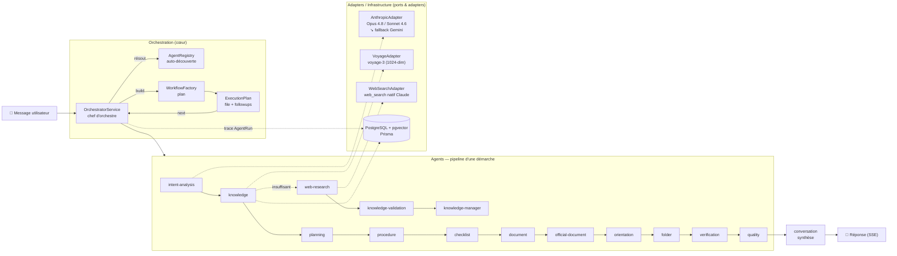

<p align="center">
  <a href="http://nestjs.com/" target="blank"></a>
</p>

[circleci-image]: https://img.shields.io/circleci/build/github/nestjs/nest/master?token=abc123def456
[circleci-url]: https://circleci.com/gh/nestjs/nest

  <p align="center">A progressive <a href="http://nodejs.org" target="_blank">Node.js</a> framework for building efficient and scalable server-side applications.</p>
    <p align="center">
<a href="https://www.npmjs.com/~nestjscore" target="_blank"></a>
<a href="https://www.npmjs.com/~nestjscore" target="_blank"></a>
<a href="https://www.npmjs.com/~nestjscore" target="_blank"></a>
<a href="https://circleci.com/gh/nestjs/nest" target="_blank"></a>
<a href="https://discord.gg/G7Qnnhy" target="_blank"></a>
<a href="https://opencollective.com/nest#backer" target="_blank"></a>
<a href="https://opencollective.com/nest#sponsor" target="_blank"></a>
  <a href="https://paypal.me/kamilmysliwiec" target="_blank"></a>
    <a href="https://opencollective.com/nest#sponsor"  target="_blank"></a>
  <a href="https://twitter.com/nestframework" target="_blank"></a>
</p>
  <!--[](https://opencollective.com/nest#backer)
  [](https://opencollective.com/nest#sponsor)-->

## 🧠 Architecture — Orchestrateur IA & Agents

Orchestrateur **multi-agents maison** (NestJS, architecture hexagonale). Le routage est
**supervisé par le code** (pas par le LLM) : chaque agent lit l'`AgentContext`, renvoie un
`AgentResult` et peut réclamer la suite via ses `followups` ; c'est l'`OrchestratorService`
qui décide, exécute et trace.

### Schéma (latéral, gauche → droite)



### Fallback ASCII (si Mermaid n'est pas rendu)

```
   💬 Message
      │
      ▼
┌─────────────────────────────┐        ┌───────────────────────────┐
│  ORCHESTRATION (cœur)        │        │  ADAPTERS / INFRA         │
│                              │        │                           │
│  OrchestratorService ──────► │ ◄────► │  AnthropicAdapter         │
│    │  résout   │  build      │        │   Opus 4.8 / Sonnet 4.6   │
│    ▼           ▼             │        │   ↘ fallback Gemini       │
│  AgentRegistry WorkflowFactory│       │  VoyageAdapter (voyage-3) │
│  (découverte)      │         │        │  WebSearchAdapter (Claude)│
│                    ▼         │        │  PostgreSQL + pgvector    │
│              ExecutionPlan   │        │  (Prisma)  ◄── AgentRun    │
│              (file+followups)│        └───────────────────────────┘
└──────────────┬──────────────┘
               ▼
   AGENTS — pipeline d'une démarche
   intent-analysis
        └─► knowledge ──(insuffisant)──► web-research ─► knowledge-validation ─► knowledge-manager
               └─► planning ─► procedure ─► checklist ─► document
                      └─► official-document ─► orientation ─► folder ─► verification ─► quality
                                                                                          └─► conversation ─► 📡 Réponse (SSE)
```

### Les 4 briques de l'orchestrateur

| Composant | Rôle | Fichier |
|---|---|---|
| **OrchestratorService** | Chef d'orchestre : boucle de dispatch, propage les `followups`, garde-fou `MAX_DISPATCHES`, journalise `AgentRun` | `src/orchestration/orchestrator.service.ts` |
| **AgentRegistry** | Auto-découverte des agents via le `DiscoveryService` de NestJS (OCP : ajouter un agent ne touche pas l'orchestrateur) | `src/orchestration/agent-registry.ts` |
| **WorkflowFactory** | Traduit l'intention en plan d'exécution (séquence ordonnée d'agents) | `src/orchestration/workflow.factory.ts` |
| **ExecutionPlan** | File d'exécution ordonnée + insertion dynamique des `followups` (`front`, `allowRerun`, dédup) | `src/orchestration/execution-plan.ts` |

Socle commun : **`BaseAgent`** (mesure du temps, erreur → `failed` sans casser le workflow),
contrats **`IAgent` / `AgentContext` / `AgentResult`**. Coordination via **`EventEmitter2`**
et **streaming SSE** vers le frontend (`onAgentStep`).

> Équivalences avec les frameworks connus : `AgentContext` = état partagé, les agents = nœuds,
> `followups` = arêtes conditionnelles, `OrchestratorService` = superviseur/router —
> les mêmes patterns que **LangGraph / CrewAI**, mais **sans dépendance** et 100 % maîtrisés.

## Description

[Nest](https://github.com/nestjs/nest) framework TypeScript starter repository.

## Project setup

```bash
$ npm install
```

## Compile and run the project

```bash
# development
$ npm run start

# watch mode
$ npm run start:dev

# production mode
$ npm run start:prod
```

## Run tests

```bash
# unit tests
$ npm run test

# e2e tests
$ npm run test:e2e

# test coverage
$ npm run test:cov
```

## Deployment

When you're ready to deploy your NestJS application to production, there are some key steps you can take to ensure it runs as efficiently as possible. Check out the [deployment documentation](https://docs.nestjs.com/deployment) for more information.

If you are looking for a cloud-based platform to deploy your NestJS application, check out [Mau](https://mau.nestjs.com), our official platform for deploying NestJS applications on AWS. Mau makes deployment straightforward and fast, requiring just a few simple steps:

```bash
$ npm install -g @nestjs/mau
$ mau deploy
```

With Mau, you can deploy your application in just a few clicks, allowing you to focus on building features rather than managing infrastructure.

## Resources

Check out a few resources that may come in handy when working with NestJS:

- Visit the [NestJS Documentation](https://docs.nestjs.com) to learn more about the framework.
- For questions and support, please visit our [Discord channel](https://discord.gg/G7Qnnhy).
- To dive deeper and get more hands-on experience, check out our official video [courses](https://courses.nestjs.com/).
- Deploy your application to AWS with the help of [NestJS Mau](https://mau.nestjs.com) in just a few clicks.
- Visualize your application graph and interact with the NestJS application in real-time using [NestJS Devtools](https://devtools.nestjs.com).
- Need help with your project (part-time to full-time)? Check out our official [enterprise support](https://enterprise.nestjs.com).
- To stay in the loop and get updates, follow us on [X](https://x.com/nestframework) and [LinkedIn](https://linkedin.com/company/nestjs).
- Looking for a job, or have a job to offer? Check out our official [Jobs board](https://jobs.nestjs.com).

## Support

Nest is an MIT-licensed open source project. It can grow thanks to the sponsors and support by the amazing backers. If you'd like to join them, please [read more here](https://docs.nestjs.com/support).

## Stay in touch

- Author - [Kamil Myśliwiec](https://twitter.com/kammysliwiec)
- Website - [https://nestjs.com](https://nestjs.com/)
- Twitter - [@nestframework](https://twitter.com/nestframework)

## License

Nest is [MIT licensed](https://github.com/nestjs/nest/blob/master/LICENSE).
